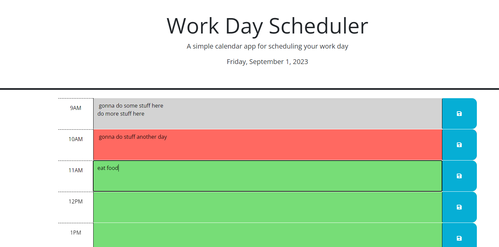

# Work Day Scheduler

A simple daily planner application to help busy individuals manage their schedules efficiently.

## Table of Contents

- [Description](#description)
- [Features](#features)
- [Installation](#installation)
- [Usage](#usage)
- [Deployed App](#deployed-application)
- [License](#license)
- [Contributing](#contributing)
- [Acknowledgment](#acknowledgment)

## Description

The Work Day Scheduler is a browser-based calendar application that allows users to save events for each hour of the standard business day. This app runs in the browser and features dynamically updated HTML and CSS powered by jQuery. It uses the [Day.js](https://day.js.org/en/) library to manage date and time.

### Features

- **Current Date Display**: Displays the current day at the top of the calendar.
- **Hourly Time Blocks**: Presents time blocks for standard business hours.
- **Time-Sensitive Styling**: Time blocks are color-coded to indicate whether the time is in the past, present, or future.
- **Event Saving**: Allows users to click into a time block, enter an event, and save it.
- **Persistent Data**: Events are saved to local storage and persist even when the page is refreshed.

## Installation

1. Clone the repository or download the zip file.
2. Open `index.html` in your preferred browser.

## Usage

1. Check the current date displayed at the top.
2. Scroll down to view hourly time blocks.
3. Click on a time block to enter an event.
4. Click the save button next to the time block to save the event.
5. Refresh the page to see that your event persists.

## Deployed Application
[WorkDay Scheduler](https://dustinii.github.io/workDayScheduler/)

## License

This project is licensed under the MIT License.

## Contributing

Pull requests are welcome. For major changes, please open an issue first to discuss what you would like to change.

## Acknowledgment

- The project uses the [Day.js](https://day.js.org/en/) library for date and time management.
- Styling is powered by Bootstrap.
